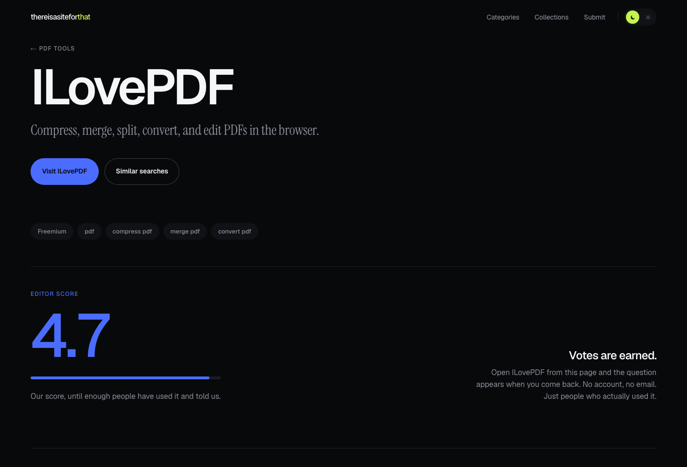

# thereisasiteforthat

**Need a website to do X? Here is the best one.**

A searchable directory of useful websites. Describe a task in plain language and get the site that does it, curated matches first, an AI-inferred answer when the catalog has no confident match.

Live at [thereisasiteforthat.com](https://thereisasiteforthat.com).


## What makes it different

**One answer, not fifty.** A search returns a best match with a confidence score, and the rest stays behind one press.

**Sites are judged by people who used them.** After you click through, the site asks a single question: *did it solve it?* No account, no email. The right to vote is earned by actually visiting, which is far harder to farm than an open star widget. Under three verdicts, an editor score stands in.



**It looks like itself.** A black canvas, one saturated colour per category and collection, and numbers set large. The rules are written down in [docs/06-ux-design.md](./docs/06-ux-design.md) so they survive the next feature.


## Run it

```bash
npm install
cp .env.example .env
```

Fill in `DATABASE_URL`, `ADMIN_PASSWORD`, `ADMIN_SESSION_SECRET` and `OPENAI_API_KEY`. Full walkthrough in [docs/10-setup.md](./docs/10-setup.md).

```bash
npm run db:migrate
npm run db:seed
npm run db:embed
npm run dev
```

Open [localhost:3000](http://localhost:3000). Admin lives at `/admin/login`.

> **Upgrading a deployment that predates verdicts:** one additive migration creates `site_votes`. Run `npm run db:migrate`. Safe to deploy the code first, since every vote read is wrapped and falls back to editor scores.

## Docs

Start with [`docs/`](./docs/README.md). It has a map, the current state of every area, and reading paths depending on why you are there.

| If you want to | Read |
|---|---|
| Understand the product | [01-prd.md](./docs/01-prd.md) |
| Change the interface | [06-ux-design.md](./docs/06-ux-design.md) |
| Know why something is the way it is | [09-decisions.md](./docs/09-decisions.md) |
| Get it running | [10-setup.md](./docs/10-setup.md) |

## Stack

| Layer | Choice |
|---|---|
| Framework | Next.js App Router, TypeScript, Tailwind |
| Database | Supabase Postgres with pgvector and pg_trgm, connection string only |
| ORM | Drizzle with `postgres.js` |
| AI | OpenAI `text-embedding-3-small` for ranking, `gpt-4o-mini` for weak matches |
| Voting | Anonymous signed cookie, no third party |
| Admin auth | Password with a signed cookie |
| Accounts | Auth.js with Google, built and switched off. See [11](./docs/11-user-accounts-features.md) |
| Hosting | Vercel |

## Scripts

| Command | Does |
|---|---|
| `npm run dev` | Local server |
| `npm run build` | Production build |
| `npm run lint` | ESLint |
| `npm run typecheck` | TypeScript, no emit |
| `npm run db:migrate` | Apply migrations |
| `npm run db:seed` | Seed categories, sites, collections, search pages |
| `npm run db:embed` | Embed published sites missing vectors |
| `npm run db:generate` | Generate a migration from schema changes |
| `npm run db:push` | Push schema without migration files |
| `npm run db:studio` | Drizzle Studio |

## Layout

```
src/
  app/            Routes, API handlers, loading skeletons
  components/     Chrome, home sections, theme, ui primitives
  features/       Search, sites, votes, submissions, admin
  lib/
    db/           Drizzle client and schema
    design/       Accent palette, per-entity colour
    votes/        Anonymous voter identity
    repositories/ Data access only
    services/     Business logic
    validators/   Zod schemas
    utils/        Pure helpers
    seo/          JSON-LD and absolute URLs
  data/seed/      Catalog seed content
docs/             Product and engineering docs
drizzle/          SQL migrations
scripts/          Seed and embed runners
```

## Conventions

Read [AGENTS.md](./AGENTS.md) before writing code. This Next.js version differs from what most tooling assumes, so check `node_modules/next/dist/docs/` rather than guessing.

Copy has one hard rule: **no dashes**, not em, not en, not as separators. Use a full stop, a comma or a slash.
