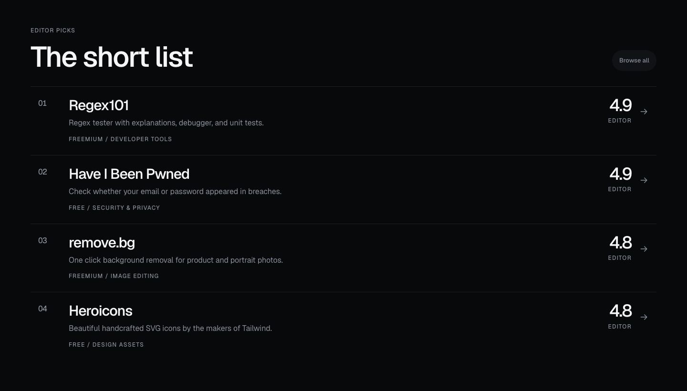
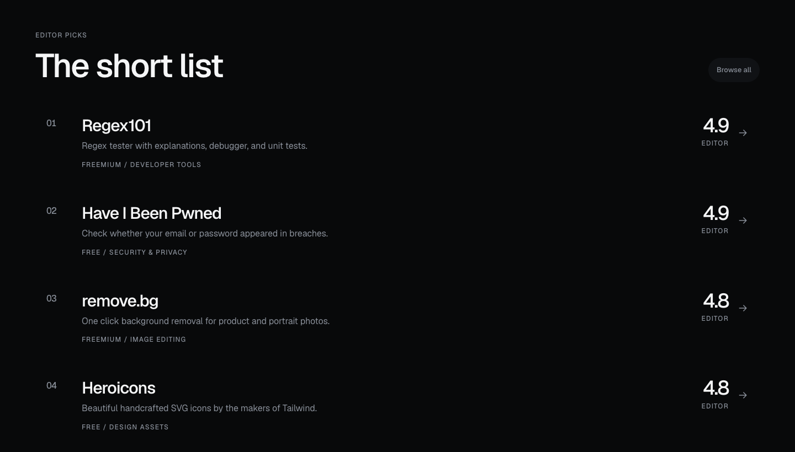

# UX Design, Monolith

**Carved, not decorated.** A black canvas, one saturated colour per entity, architectural numerals, and space. Search-first. The goal is identity: with the logo removed and the text blurred, the screen should still be recognizable as this product.


---

## 1. Design Principles

1. **Search is the product.** First viewport = one line of display type + one very large search pill.
2. **One obvious thing per screen.** If two elements compete for attention, both lose.
3. **Black is home. Colour is a destination.** Entering a collection, category, or site hands the interface that entity's colour.
4. **Numbers are the artwork.** Counts, ratings, and confidence are set large, mono, and tabular; explanatory text nearly disappears.
5. **Honest AI.** Curated vs AI-inferred is always labelled.
6. **Outbound is success.** The primary CTA is always "Visit site."
7. **Light + dark.** Dark is the default; light is the same geometry on bone paper.

---

## 2. Visual Direction

Four ingredients only: **black, saturated colour, typography, space.** No blur, glass, gradients, glow, shadows, or texture. Emphasis comes from size, separation from space, hierarchy from colour, never from fake depth.

### Tokens (`src/app/globals.css`)

| Token | Dark (home) | Light (paper) |
|---|---|---|
| `--paper` | `#08090a` | `#ededea` |
| `--layer` | `#101215` | `#ffffff` |
| `--layer-2` | `#191c21` | `#e2e2dc` |
| `--ink` | `#f5f6f7` | `#08090a` |
| `--muted` | `#898f99` | `#5f636a` |
| `--hair` | `rgba(245,246,247,.10)` | `rgba(8,9,10,.12)` |
| `--accent` | per-entity, default `#c6f24e` | same |
| `--on-accent` | `#08090a` | `#08090a` |

**Accent as text.** The raw accent is unreadable on paper, so accent *text* is mixed with black at the point of use (`.ink-accent`, `.label-accent`) via `--accent-strength` / `--accent-strength-small`. It is never resolved into a derived token, that would break the per-entity override. Accent as *fill* is always used raw.

**Radii, one system, doubling:** `--r-s: 7px`, `--r-m: 14px`, `--r-l: 28px`, `--r-xl: 56px`, `--r-pill`. Nothing outside this scale.

### Typography, three voices

Never one family doing every job. Each voice means something, and mixing them by accident is the tell of a generic interface.

| Voice | Family | Job | Classes |
|---|---|---|---|
| The product | Geist (variable) | Headlines, site names, controls, body | `.display` (-0.055em, 0.88), `.headline` |
| The machine | Geist Mono (variable) | Numbers, metadata, micro-labels | `.numeral`, `.label` (11px, 0.14em, uppercase) |
| The editor | Instrument Serif | The one lead line that opens a page | `.lede`, `.quote` |

One engineered superfamily carries the interface, Geist is neutral enough to hold at 6rem and stay sharp at 13px, and its mono is drawn to match. The serif appears exactly once per page, on the lead, so it reads as a deliberate change of voice rather than decoration.


**Colour system:** eight accents in `src/lib/design/accent.ts`. Catalog entities get an authored colour from `ASSIGNED` so no two neighbours in a grid collide; anything else falls back to an FNV hash of its slug. Apply with `accentStyle(slug)` on any wrapper, every descendant inherits it.

### Primitives

| Class | Use |
|---|---|
| `.shell` | The single page gutter, max 88rem |
| `.slab` / `.slab-accent` | Flat surface block / entity-owned block |
| `.btn` + `.btn-accent` / `.btn-quiet` / `.btn-line` | Pills; every press compresses |
| `.chip` | Small pill (queries, tags) |
| `.field` | Input, softer than a card, accent focus ring |
| `.flood` | Tile that takes its accent on hover/press |
| `.row` | List entry; index turns accent, arrow glides. Rows never carry a divider, see below |
| `.press` | Compress-on-press for anything else |

### Mechanisms

Motion is part of the object, never applied to it. Six devices, reused everywhere:

| Device | Where | What it does |
|---|---|---|
| `KineticHeadline` | Home hero | "There is a site for ___" fills itself in with real queries; the word is a live search link. Sized off the longest query in the list, once, so the page never reflows |
| `.stagger` / `.stagger-scroll` | Every list and grid | Rows arrive in sequence, scroll-driven where the browser supports it |
| `.flood-wipe` | Collection tiles | The entity's colour wipes up from the bottom edge on approach |
| `.meter` | Verdict band | The solve rate drawn as a bar that fills once |
| `NavLinks` pill | Header | One pill slides between nav items, rests on the current page, follows the pointer |
| `.theme-crossing` | Theme switch | Every colour on the page crosses to its counterpart over 1240ms, applied only for the duration of the switch |

Loading is designed too: every dynamic route has a `loading.tsx` drawing the same geometry in `.ghost` blocks under a `.scanner` line, no spinners, no layout shift.

### Rows separate with space, never with lines

A list of like items gets no dividers. Space does the separating and a hover fill
gives the row its edge. A rule is reserved for marking where one section ends and
another begins, which is a different job.

| Before | After |
|---|---|
|  |  |

The first version shipped with a hairline between every row, which contradicts
two entries in the anti pattern list further down this document. It was the quick
way to stop rows merging, and quick is how anti patterns get in.

If a line free list ever reads as too loose, the fix is more space or larger index
numerals carrying the rhythm. It is not bringing the rule back.

**Motion.** Panels assemble (`.enter`, `.sheet`, `.wipe`); numbers count (`CountUp`); indicators glide; buttons compress. Nothing fades except things leaving forever. Sections arrive on approach through scroll-driven animation (`.reveal`, `animation-timeline: view()`) with no JS at all. Opening a site morphs its name from the list row into the page heading, React `<ViewTransition name="site-<slug>">`, enabled by `experimental.viewTransition`. All of it collapses under `prefers-reduced-motion`.

**Keyboard.** `/` focuses search from anywhere; `Escape` releases it.

**Avoid:** bordered card grids, stacked panels, hairline boxes as hierarchy, decorative icons, emoji, gradients or glow of any kind.

---

## 3. Progressive Disclosure

A website is an interface, not a PDF. Every page answers **one** question; everything that supports a *later* decision waits behind an interaction.

| Layer | What it holds | How it is reached |
|---|---|---|
| 1 | The one thing the page exists to say | Immediately visible |
| 2 | Supporting detail | Below the fold, or one press |
| 3 | Technical detail | `Disclosure`, `RevealList`, hover |
| 4 | Everything else | Its own page |

Primitives:

- **`Disclosure`**, native `<details>`, so it is keyboard accessible, findable by browser search, and works with no JavaScript. Used for alternatives on a site page and the optional half of the submit form.
- **`RevealList`**, shows the first N children and keeps the tail behind one press. Used for the search result tail.
- **Cards linking deeper**, collection tiles and category chips carry a count and a colour, not a description dump.

Applied:

| Surface | Before | Now |
|---|---|---|
| Home | 5 stacked sections, ~4,460px | ~3,460px, 4 editor picks instead of 8, categories as 6 chips instead of 12 full rows |
| Search results | Best match + 9 full rows | Best match + 3, rest behind "Show N more matches" |
| Site page | Alternatives always expanded | Behind `Alternatives, 3 in PDF Tools`, hiding ~460px |
| Submit | 6 fields | 4 required; tags and email behind "Optional" |
| List rows | Name, description, pricing, category, 3 tags | Name, description, pricing, category, tags live on the site page |

**Rule:** when choosing between showing everything and hiding what is not yet relevant, hide it. Only surface information that helps the reader make their *next* decision.

---

## 4. Information Architecture

```
/                         Homepage
/search/[slug]            Indexable results page
/site/[slug]              Website detail
/categories               Category index
/categories/[slug]        Category landing
/collections              Collections index
/collections/[slug]       Collection landing
/submit                   Public submission form
/signin                   "Not yet", accounts are deferred, and says why
/me                       Account shelf, built, unreachable until sign-in ships
/admin                    Admin console (gated)
```

Nav: wordmark · Categories · Collections · Submit · theme switch. There is no logo, the name *is* the mark, set tight and lowercase with one accent stop on "that". No account entry point while sign-in is deferred; `/signin` explains itself.

---

## 5. Page Specs

### 5.1 Homepage

Components under `src/components/home/`:

1. **Hero** (`HomeHero`), label, three-line display headline, the search pill, query chips, then a rule and three stats.
2. **Collections** (`CollectionDestinations`), six flood tiles; count in the collection's own colour, floods on hover. The seventh lives on `/collections`.
3. **Editor picks** (`FeaturedPicks`), four rows, then "Browse all". Enough to show what the catalog is like.
4. **Category map** (`CategoryMap`), the six busiest as chips, then "All categories". The full index is its own page.
5. **Submit band** (`SubmitBand`), one accent slab, the only flooded block on the page.


### 5.2 Community verdicts, how a site earns its number

Star ratings from anonymous strangers are noise, and we have no accounts to tie them to. So the product asks the only question it actually cares about, **"Did it solve it?"**, and only asks people who went.

| Rule | Why |
|---|---|
| You may only vote on a site you clicked through to | The right to judge is earned by use. Farming a verdict means actually visiting, which is exactly the behaviour we want anyway |
| Identity is an HttpOnly signed cookie, hashed per site | No account, no email, and the stored row cannot be joined back into a browsing history |
| One vote per device per site, revisable | Changing your mind is normal; ballot-stuffing is not |
| Under 3 verdicts, the editor score shows instead | A percentage from one person is noise pretending to be data |

Submissions feed the same catalog: **Approve** on `/admin/submissions` builds a real draft site from what the submitter typed and drops the admin on its edit page to add pros, cons, and a score. Approving is a publish step, not a status flag.

Displayed as **solve rate**, a percentage, which suits a system built on architectural numerals far better than five stars ever did. The editor score is the cold-start value, never the long-term one. Rate limiting and the eligibility gate live in `/api/vote`; the schema is `site_votes` in [04-data-model.md](./04-data-model.md).

### 5.3 Search results

The best match is the page: a full accent slab owned by the winning site with its name at display size and the confidence percentage as an architectural numeral. Everything after it is a ranked list.

### 5.4 Interior pages

`PageHead` opens every one: label (or back link), display title, lead, and the one number the page is about.

---

## 6. Theme

- Modes: `dark` (default) | `light`, persisted in `localStorage`
- FOUC-safe: inline script adds `class="light"` before paint
- Switching cross-fades every colour on the page at once: a `theme-crossing` class goes on `<html>` for the length of the transition, so the 1240ms colour travel never leaks into hover states. `disableTransitionOnChange` is deliberately off
- The switch is driven by CSS keyed off `html.light`, never React state, correct on first paint, no hydration flash. The knob is thrown across with a slight overshoot and its glyph rotates through

---

## 7. Explicit Anti-Patterns

- Decoration pretending to be hierarchy (borders, shadows, glows)
- Card grids where a list would do
- Two hero-weight elements on one screen
- The infinite scroll of death: stacking another section instead of reorganising
- Making someone scroll past information they will never need
- Colour used because it looks nice rather than because it means somewhere
- Random radii, accidental spacing, mixed icon weights
- Type that resizes with its content and shoves the page around
- Counters and odometers, a number that has to perform to be interesting is a weak number
- Copying TAAFT's AI-only framing
